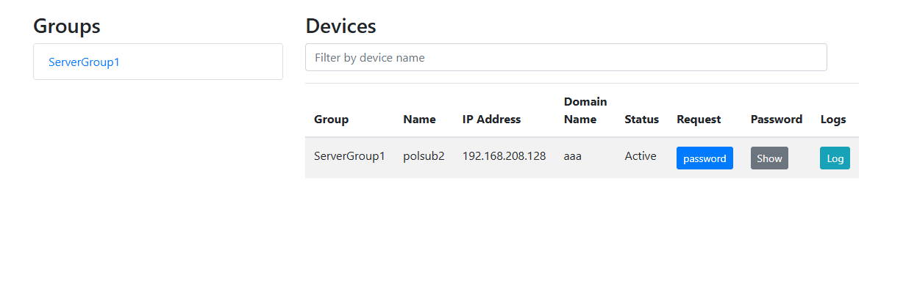
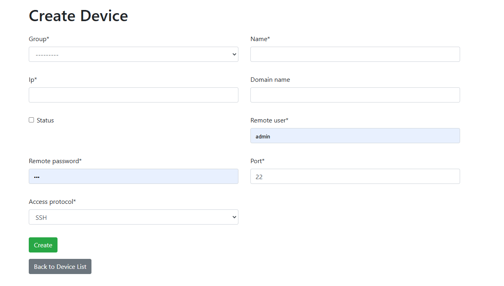

# My Pass Application

## Introduction

This application is developed to manage usernames and passwords in your server farm. It allows you to create server groups and set permissions for users to access these groups. You can define devices within each server group, and for each device, you need to create a username and password with root permission.

On the home page, when a user wants to access a server, they can send a password request and set a validation time for this request. The My Pass application will connect to the device and create a user with a randomly generated password.


## Features

- **Server Group Management**: Create and manage server groups.
- **Permission Settings**: Assign permissions to users for accessing server groups.
- **Device Management**: Define devices within server groups.
- **User and Password Management**: Create usernames and passwords with root permissions on devices.
- **Password Requests**: Allow users to request passwords with a set validation time.
- **Automatic User Creation**: Automatically create users with random passwords on devices.






# My Pass Application - Help Guide

## Overview

The My Pass Application web interface is designed to manage server groups and devices efficiently. This guide provides detailed instructions on how to use the features displayed in the interface.

## Sections

### 1. Groups

The left side of the interface shows a section labeled "Groups". This section lists all the server groups that have been created. For example, "ServerGroup1" is displayed.

- **Viewing Groups**: You can view all available groups in this section.
- **Selecting a Group**: Click on a group name to select it and view the devices associated with that group on the right side.

### 2. Devices

The right side of the interface is dedicated to managing devices within the selected group. This section includes a filter input box and a table listing device details.

#### Filter Input Box

- **Filtering Devices**: Use the input box to filter devices by name. Type the name of the device you're looking for, and the table will automatically update to show matching results.

#### Device Table

The table contains the following columns:

- **Group**: Displays the name of the server group the device belongs to. For example, "ServerGroup1".
- **Name**: Shows the device's name. For example, "polsub2".
- **IP Address**: Lists the device's IP address. For example, "192.168.208.128".
- **Domain Name**: Displays the domain name associated with the device. For example, "aaa".
- **Status**: Indicates whether the device is active or inactive. Active devices are highlighted in the table.
- **Request**: Contains a blue button labeled "password". Click this button to request a password for the device.
- **Password**: Displays a gray button labeled "Show". Click this button to reveal the device's password after confirmation.
- **Logs**: Contains a teal button labeled "Log". Click this button to view the device's logs.

### Interacting with Devices

#### Requesting Passwords

1. **Click on the "password" button**: This button is found under the "Request" column. It allows you to send a password request for the selected device.
2. **Set Validation Time**: After clicking the button, set the validation time for the password request as needed.

#### Showing Passwords

1. **Click on the "Show" button**: This button is found under the "Password" column. It allows you to view the password for the selected device.
2. **Confirm the Action**: A confirmation dialog will appear. Confirm your action to reveal the password.

#### Viewing Logs

1. **Click on the "Log" button**: This button is found under the "Logs" column. It allows you to access the logs for the selected device.
2. **Review Device Logs**: The logs will display relevant information and activities related to the device.


## Setup Instructions

Follow these steps to set up the project on your server:

### Prerequisites

- Python 3.8 or higher
- Django 3.2 or higher
- pip (Python package installer)
- Git

### Installation

1. **Clone the Repository**:
   ```bash
   git clone https://github.com/yourusername/mypass.git
   cd mypass
   python3 -m venv venv
   source venv/bin/activate  # On Windows use `venv\Scripts\activate`
   pip install -r requirements.txt
   python manage.py migrate
   python manage.py createsuperuser
   python manage.py runserver

   
### Usage 
Navigate to http://yourserverip/admin and log in with the superuser credentials.


 ## First Release

This application represents the first release of My Pass Application. It has been designed to simplify the management of usernames and passwords across your server farm. We are excited to bring you this tool and hope it meets your needs for efficient and secure password management.

If you have any feature requests, need support for deployment, or require assistance with debugging, please do not hesitate to reach out. Your feedback is incredibly valuable to us as we continue to improve and enhance the application.

For support, please send your requests to: **iman.mir@gmail.com**

We look forward to hearing from you!

